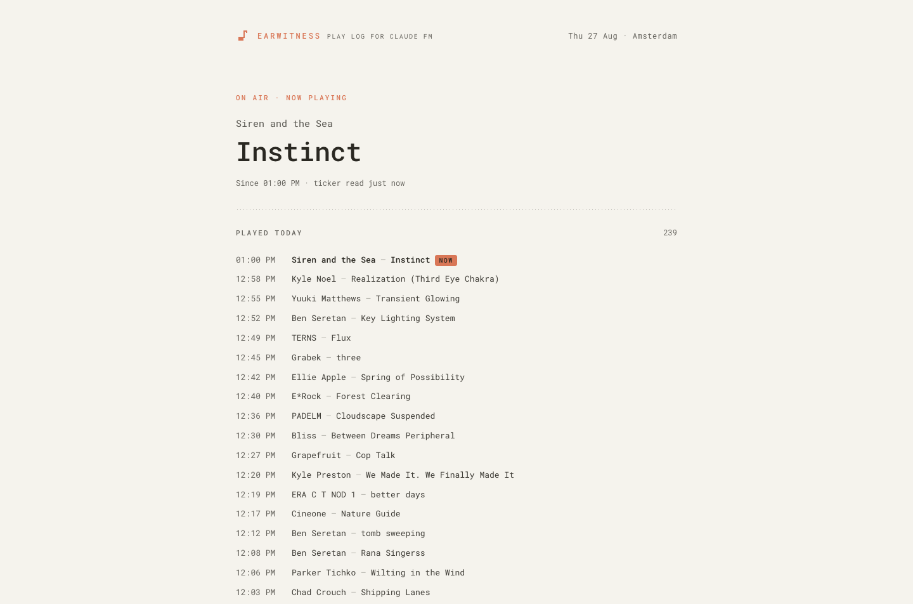

# Earwitness

An independent play log for [Claude FM](https://www.youtube.com/@claude/live),
Anthropic's 24/7 stream. One always-on page showing what it has played **today**.
Unofficial, and not affiliated with Anthropic.



*Drawn at 1440. The plays above are seeded sample data, not a real capture.*

Two supervised processes on one host, no AI calls.

- `tracker/` — Bun + TypeScript loop: every 30 s it OCRs the credit ticker from
  one cropped video frame; on song change it captures a 30 s burst at 2 fps and
  stitches the ~60 marquee fragments into one canonical `Artist — Title` unit. A
  stitch it is not sure of goes to the journal with its fragments, not onto the
  row. It also stamps a heartbeat every tick, records that the marquee still
  reads as the song already logged, and prunes at the Amsterdam day boundary.
- `web/` — Astro + Tailwind, server-rendered on every request: `/` is the only
  page. Times in Europe/Amsterdam, 12-hour with AM/PM (stored in UTC).
- `shared/` — the two things both processes must agree on and nothing else: how
  a credit splits into artist and title, and where the state directory is. Pure
  functions and constants, no I/O.

**Today only.** At Europe/Amsterdam midnight the tracker drops the previous day's
plays, and there is nothing else to drop — a play references nothing outside its
own array. Then it starts collecting again. There is no archive and no dated
route — by design, not omission. The day boundary is Amsterdam regardless of
where the server or the viewer is.

## Requirements

`bun`, `yt-dlp`, `ffmpeg`, `tesseract` on PATH, plus `deno` for `yt-dlp`:
YouTube extraction without a JavaScript runtime is deprecated, and this tracker
re-resolves the stream URL on every tick. Any runtime yt-dlp supports will do;
deno is the one it looks for by default. Both processes must run on the
**same host**: they share one state directory, and the atomic-rename guarantee
the state layer depends on is not reliable across a network filesystem.

## Configuration

`EARWITNESS_STATE` — the **directory** holding the three state files, resolved by
both processes. Default `~/.local/share/earwitness/`, deliberately outside the
deployment directory so a redeploy cannot discard the current day. On a
containerized host it must point at a mounted volume.

Both processes must resolve the *same* directory; a divergent path is a silent
split-brain where each is right about a different empty directory. The default
therefore has exactly one definition, in `shared/`, and neither package keeps a
copy of it.

## Running it locally

```bash
bun install                                  # once, at the ROOT: it is a workspace
cd tracker && bun run tracker.ts             # terminal 1
cd web     && bun run dev                    # terminal 2 → localhost:4321
```

The root `package.json` declares the three packages as a workspace. Installing
inside one of them instead is not a shortcut: `web/` imports `@earwitness/shared`,
and without a workspace root Vite resolves `server.fs.allow` to `web/` alone and
the dev server refuses to read the file.

The tracker logs one line per event (play, anomaly, URL re-resolve, rollover).
The page renders per request and meta-refreshes every 30 s, so new plays appear
without interaction and without any client-side JavaScript.

## Deploying it

The repo carries no deployment config — supervise the two processes with
whatever the host already runs. They must live on the **same host** and resolve
the **same** `EARWITNESS_STATE` directory, on persistent storage and outside the
checkout so a redeploy cannot discard the current day.

```bash
bun install                  # workspace root: all three packages
cd web && bun run build      # web needs a build; it is SSR
```

Then `bun run tracker.ts` from `tracker/`, and `bun ./dist/server/entry.mjs`
from `web/`. Running the built output under Bun keeps one toolchain across both,
but nothing requires it: the data layer reads three plain files through `node:fs`
and pulls in no native binding or runtime builtin, so `node
./dist/server/entry.mjs` serves the same build identically.

Two things a supervisor has to get right:

- **PATH.** The tracker shells out to `yt-dlp`, `ffmpeg` and `tesseract`. A
  service manager's default PATH typically omits `/usr/local/bin`, which is
  where Bun and yt-dlp usually land.
- **Restart backoff.** Give the tracker roughly 15 s between restarts — long
  enough that a yt-dlp bot challenge or an off-air stream does not become a hot
  restart loop, short enough to recover a crash within one tick.

**Before provisioning, prove the stream resolves from that host:**

```bash
yt-dlp -g 'https://www.youtube.com/@claude/live'
```

YouTube commonly serves a bot challenge to datacenter IP ranges. A failure here
is not a bug to fix later — it reopens the hosting choice (PO-token sidecar,
residential proxy, or capturing from a residential host).

## Design

One responsive page, drawn at 1440, 834 and 390.

The mark is *Pixel Note*, an eighth note on a 12×12 grid: 21 blocks, one
geometry from the header down to the favicon, drawn in `currentColor` so it
inherits the health tone — terracotta on air, grey off air, ochre in trouble.
The live accent is Claude's own orange and the ochre is sampled off a live frame
of the stream, so the page reads as a companion to what it tracks. The orange
runs at one tier — the mark, the wordmark and the `now` chip carry the literal
#d97757, at a measured 2.8:1 on paper. Ochre stays in two tiers, where the
`-text` suffix marks the one that may set type. Type is Roboto Mono, behind the
platform monospace stack.

The design system *is* Tailwind's theme: `web/src/styles/global.css` declares the
palette, ten type steps, six tracking values and exactly two breakpoints (700px
and 1100px, with the rest of the namespace cleared). Note that a class outside
the theme — an `sm:` variant, a mistyped token — generates no CSS and sits inert
rather than erroring, so changes are checked at the two real widths.

Two states the page deliberately does not have:

- **There is no "ticker unreadable" state.** A failure count is operator
  telemetry a viewer cannot act on, so it maps onto the 15-minute silence state
  — same ochre treatment, the silence reported instead of the count. It goes to
  the journal.
- **The log is never truncated.** With no archive and no client-side JavaScript,
  a "172 earlier plays" label leads nowhere, so the day renders in full (a full
  day's ~450 rows is ≈150 KB) and the total stays in the log header.

## Reading the ticker

The marquee scrolls one credit on a loop, so no single frame holds the whole
thing. A burst is 30 s at 2 fps and the stitcher recovers the credit from it:
align the fragments on a shared column axis by best overlap, vote per column,
detect the loop's repeat period, fold the votes modulo that period, then rotate
the cyclic result to the loop boundary.

Two details are worth knowing before touching any of it, both paid for on
2026-08-26: of that day’s 62 failed bursts, 44 died at period detection with a
readable consensus already in hand, and replaying them against the bounds below
recovered 24.

- **The period bounds are the credit's own length.** `MIN_PERIOD` and
  `MAX_PERIOD` in `stitch.ts` bracket how long a credit may be, and both were
  measured too narrow: `Grabek — three` loops every 15 columns and
  `Ben Seretan — criss cross applesauce right in the stream of the amp` every
  ~70. A credit outside the bracket is not found at all, or is found at a
  multiple of its period. They now run 12–96, and `burstSeconds` has to keep
  covering two loops of the longest — see the note on it in `config.ts`.
- **A fold can come out holding whole copies of the credit.** One copy is then
  the unit, and `collapseRepeats` keeps it; the test is rotation, not a split
  down the middle, because the ♪ separator OCRs at a different width in each
  repetition (`Passport — Reunion` folds as 19 + 21 columns). What must never
  reach the row is the other case — copies that merely resemble each other,
  which is a fold that smeared two readings together and parses perfectly well
  as a credit. `validUnit` refuses anything that still repeats.

Alignment runs twice. The first pass scores each fragment against whatever was
placed before it, so the early ones are judged by a nearly empty tally; the
second scores every fragment against the finished consensus of the first, and is
kept only when it places more of them.

A burst that will not stitch at all is retried on each half, the later one
first — the tracker bursts because the marquee changed, so a burst that straddles
the change holds two credits and nothing explains all of it. A half is weaker
evidence and has to be cleaner: one that could not align a third of its frames
is refused, which is what keeps a fold that came out a period short off the row.
Every result from this path is low-confidence and carries `burst_split` into the
journal.

**Where the burst is cut.** Halving it is only right when the change happens to
sit at the midpoint. `transitionIndex` finds where it actually sits, by scoring
every cut on how little the trigrams before it share with those after: within one
song both sides read the same credit and the score stays high everywhere, so no
transition is reported and the midpoint is used exactly as before. Adjacent-frame
similarity was tried first and is not usable — OCR drops whole frames to noise,
and its minima land mid-song. The cut is then searched a few frames PAST the
transition, because the frames catching the marquee mid-redraw are degenerate and
cost the later half its repeat period.

Of the 62 bursts that failed on 2026-08-26, this all recovers 30, and the
transition-aware cut adds 3 more on that day's 85 recorded failures — including
the 12:03 straddle that lost `Keen Collective — Beginnings`. The rest place
too few frames to span two loops of the marquee — their consensus is usually
readable, which is the standing hint that the next gain is in the OCR (the crop
goes to tesseract unprocessed, over a dotted background) rather than in here.

**When it bursts again after a failure.** A song whose OCR is pathological would
otherwise burst on every tick, so a failed stitch buys a backoff of 2, 4 then 6
ticks. That backoff is owed by one SONG, not by the clock: it holds only while
the marquee still reads as the burst that earned it, and any other text on screen
clears it and bursts immediately. The distinction is the whole point. A blanket
backoff cannot be cleared by the cheap same-song path — that path only recognises
the song already on the row — so a change arriving mid-cooldown left the tracker
blind for one to three minutes, which at ~3 min a song is a whole play lost per
failure, and the next burst then landed mid-transition and failed in turn. On
2026-08-26 that cascade dropped 58 of 233 changes, 32 of them at streak 2 or
worse, and held the tracker blind for 122 minutes of the day.

`marqueeStillReads` makes the distinction against the failed burst's own frames
rather than a unit, because a failed stitch has no unit. Two ticks of one song
30 s apart can share almost nothing — the marquee loops several times in
between — but a 30 s burst at 2 fps holds every phase of the loop, so whatever
phase the tick caught, some frame of that burst saw it too. The budget is a
ratio, and the two errors it can make are not equal: re-bursting a song it could
have skipped costs CPU on the burst path, while mistaking a new song for the old
one costs the play. Measured that day, same-song frames score 0.11-0.26 at the
median and cross-song frames never below 0.43; the default sits at 0.40.

## Health

The tracker writes one byte to `live.flag` at the start of every tick: `1` when
the last stream URL resolution succeeded, `0` when it failed. The file's mtime is
the heartbeat — no timestamp is stored, because the filesystem already keeps one.

The page derives what to say, first match winning. It says it in the hero, which
is also where the current song goes — so good news and bad news land in the same
place and a reader learns where to look once:

| condition | kicker | headline |
| --- | --- | --- |
| `live.flag` absent | Starting up | Tuning in |
| mtime over 3 minutes old | Tracker offline | Nothing heard since HH:MM AM |
| content `0` | Off air | Nothing on the air |
| unconfirmed, newest play over 15 minutes old | Nothing coming through | Nothing new for N minutes |
| confirmed under 3 minutes ago | On air · now playing | *the song's title* |
| confirmed longer ago than that | On air · last logged | *the song's title* |
| otherwise | Listening | No song logged yet |

The hero is *above* the list, never instead of it — a stitching problem must not
hide songs already captured. Only the two states with nothing captured to show,
starting-up and listening, render no list at all.

"Now playing" is the one claim the data has to earn, and it is earned by
`confirmed.flag` rather than inferred from a clock. The tracker stamps it on
every tick whose fingerprint still matches the current song — the ~85% path — so
a track of any length keeps the claim while it is genuinely on the marquee, and
loses it within one tick of changing to something the stitcher cannot read. That
is the case an age window got wrong in both directions: a 7-minute gap with the
song demonstrably still playing was called stale, while a failed stitch left the
page asserting a row that had stopped being true.

A burst that fails to stitch stamps it too, but only when the burst's last ten
seconds still fingerprint-match the song already on the row. An unreadable
marquee and an unstitchable one are not the same thing: the frames of a
`no_repeat_period` failure routinely show the song plainly, and withholding
confirmation there told the page a lie in the other direction. Nothing else may
stamp the flag — absence of a stamp is the signal.

Fresh confirmation also vetoes the 15-minute silence state, because a long track
and a stalled tracker look identical from the play list alone and differ exactly
here — a stalled tracker confirms nothing.

Where the flag has never been stamped — a tracker older than it, or the first
seconds of a fresh state directory — the page falls back to the play's age with
a 10-minute window. The list's `now` badge comes from the same computation, so
the two can never disagree.

`presentation.ts` holds every one of those words and nothing else; `health.ts`
holds the thresholds and the order. A copy edit must not touch the second file.

The heartbeat is stamped at tick *start*, not completion: a burst tick can
legitimately run for over a minute, and the 3-minute threshold clears that.


Failure counts, retry streaks and error output are deliberately **not** on the
page. A viewer cannot act on them, and the symptom they can see is the silence
row above. They go to the journal, where the operator is.

## Data

Three plain files in `$EARWITNESS_STATE`. No database: with one day retained, every
relational feature was unused — the index covered at most ~480 rows, the unique
constraint was unreachable because dedup scans by edit distance first, and the
foreign key existed only to order the prune. What SQLite did provide, atomic
writes, is `writeState` in `tracker/src/state.ts`.

```
plays.json      ~50 KB   ~400 writes/day   temp file + rename
live.flag        1 byte   ~2880 writes/day  content 0|1, mtime = heartbeat
confirmed.flag   0 bytes  ~2450 writes/day  no content, mtime = last confirmation
```

```json
{ "version": 2,
  "plays": [{ "detectedAt": "2026-08-23T09:41:12.000Z",
              "credit": "Ben Seretan — kokosing" }] }
```

`plays.json` holds the day's plays and nothing else. A play is the observation
and only the observation: `detectedAt`, the clock at the moment the tracker
*resolved* the song — it lags the song's actual start by up to a burst, which is
what the confirmation flag absorbs — and `credit`, the stitched reading of
the ticker. Artist and title are `parseUnit(credit)` and are derived by each
reader at the point of use, so a parser fix improves the morning's rows on the
next render instead of waiting for midnight. 113 B/play, about 50 KB at a full
day's ~450 plays.

Plays are appended chronologically, and that order is what the health state
depends on — the newest play is the last element. The page renders them newest
first. `credit` is what dedup compares against, and it is compared
**rotation-invariantly**: the stitcher guesses where the marquee loop starts, so
two bursts of one song can be cut at different points and Levenshtein alone once
filed those as separate songs. On a match the play stores the credit of the entry
it matched, never the incoming one — that is what keeps one song from appearing
under two spellings, and with no track table left it is the only thing that does.
A play carries no confidence field under any name, and a test in
`tracker/test/state.test.ts` enforces that — the tracker's certainty about a
stitch is in the journal, and nothing reads it back.
Useful checks:

```bash
S=${EARWITNESS_STATE:-~/.local/share/earwitness}

jq '.plays | length' "$S/plays.json"                 # plays so far today

jq -r '.plays[-10:][] | "\(.detectedAt)  \(.credit)"' \
  "$S/plays.json"                                    # last 10 plays

cat "$S/live.flag"                                   # 1 = live, 0 = off air
stat -c %y "$S/live.flag"                            # the heartbeat (mtime);
                                                     # macOS: stat -f %Sm

journalctl -u <tracker-unit> | grep anomaly         # the only forensic record
                                                     # low_confidence_stitch =
                                                     # an uncertain row
```

**One rule when touching the state layer:** `writeFileSync` to `plays.json`
truncates before writing, so a crash mid-write destroys the day. Every write goes
through `writeState` (temp file + rename in the same directory) and there must
never be a second path.

**The version contract.** Both processes assert `version === 2` — the exact
value, not merely that it is a number. The two deploy from one checkout but run
as two systemd units and restart independently, and this field is the only thing
that notices when they disagree about the shape of the file between them.

On a mismatch they diverge, deliberately. The tracker renames the file to
`plays.json.v<n>.bak` in the same directory, logs the rename with both versions,
and continues from empty state — the file is readable and merely old, and exiting
would crash-loop a forward deploy until the next Amsterdam midnight. The web app
renders no plays, which its existing contract shows as a normal health state
rather than an error. A file that will not parse at all is a different case and
is unchanged: the tracker reports it and exits, because it cannot tell a corrupt
file from a whole day of plays.

There is no migration and there will not be one. State lives at most 24 hours by
design, so a format change costs whatever part of one Amsterdam day has
accumulated when the new binary starts.

## Field toolkit

All capture constants live in `tracker/src/config.ts`. Measured facts: crop
`crop=520:46:1390:42` at 1080p (glyphs occupy y 52-82; the scene's dotted
terrain reaches y 106, and the crop stops at 87 to stay clear of it); marquee
scrolls ≈ 4 chars/s with a ~1–2 s hold
at the unit start each loop; the ♪ glyph between loop repetitions OCRs as `C`,
`¢¢`, `dd`, a plain space, or nothing; song transitions are instant text swaps
(empty OCR = capture hiccup, not a transition).

```bash
# resolve the stream URL (the ~6 h embedded expiry is a lie: the media playlist
# is a sliding window and dies after ~25-30 s)
URL=$(yt-dlp -g 'https://www.youtube.com/@claude/live')

# single tick by hand: one cropped frame + OCR
ffmpeg -loglevel error -i "$URL" -frames:v 1 -vf "crop=520:46:1390:42" -y tick.png \
  && tesseract tick.png stdout --psm 7

# burst: two full marquee loops (stitcher input, as the tracker takes it)
ffmpeg -loglevel error -t 30 -i "$URL" -vf "crop=520:46:1390:42,fps=2" -y tick_%02d.png

# fair A/B of any filter change: record once, apply filters to identical frames
ffmpeg -loglevel error -t 12 -i "$URL" -c copy -y sample.ts

# long watch (transitions, drift): 8 min @ 0.5 fps
ffmpeg -loglevel error -t 480 -i "$URL" -vf "crop=520:46:1390:42,fps=1/2" -y t_%03d.png
```

**If the overlay ever moves or is redesigned**, grab a full frame and
re-locate the ticker, then update `crop` in `tracker/src/config.ts`:

```bash
ffmpeg -loglevel error -i "$URL" -frames:v 1 -y frame.png
```

**Row profile — where the glyphs sit, and where the terrain reaches.** The crop
has two bounds to satisfy, and neither is guessable from a screenshot: it must
contain every glyph, and it must exclude the scene's drifting halftone terrain.
Collapse each frame to one column of row averages and read both off it. Do this
on the LAPTOP against a recorded sample, not on the server — 300 tesseract calls
will starve the tracker on a four-core box.

```bash
ffmpeg -loglevel error -t 150 -i "$URL" -c copy -y sample.ts   # record once
ffmpeg -loglevel error -i sample.ts   -vf "crop=520:200:1390:0,fps=2,format=gray,scale=1:200:flags=area"   -f rawvideo -pix_fmt gray -y rows.raw
python3 - <<'"'"'EOF'"'"'
d = open("rows.raw", "rb").read(); H = 200
tops, bots, terrain = [], [], []
for i in range(len(d) // H):
    p = d[i * H:(i + 1) * H]
    glyph = [y for y in range(40, 105) if p[y] < 250]
    below = [y for y in range(95, 200) if p[y] < 250]
    if glyph: tops.append(min(glyph)); bots.append(max(glyph))
    if below: terrain.append(min(below))
print("glyphs   y", min(tops), "..", max(bots))
print("terrain reaches y", min(terrain))
EOF
```

## Tests

```bash
bun test                 # all three packages, from the workspace root

cd tracker && bun test   # stitcher, fingerprint, day boundary, prune, dedup,
                         # canonical credit, atomic writes, version contract,
                         # unreadable-state refusal
cd shared  && bun test   # parse, and the guard against a second parser
cd web     && bun test   # health thresholds and their ORDER, the hero's words,
                         # the read side's three no-rows paths, the Amsterdam
                         # day filter, and the guards keeping words out of
                         # health.ts and the two day-boundary copies in step
```

Type checking is separate, and `bun run build` does not do it — Astro transpiles
`.astro` components without checking them. The five components are covered only
by:

```bash
cd web && bun run check  # astro check: components, pages, lib and tests
```

It is held at `typescript@^6`, and the major is the part that matters:
TypeScript 7 is a native rewrite that does not yet expose the programmatic API
`astro check` calls, so it fails outright rather than degrading quietly. The
caret takes 6.x fixes and stops short of that. Track
[withastro/roadmap#1321](https://github.com/withastro/roadmap/discussions/1321)
before widening it.

## Licence

MIT — see [LICENSE](LICENSE).

Earwitness is an independent project and is not affiliated with, endorsed by, or
connected to Anthropic. It reads the public credit ticker on a public stream and
records what it sees; it redistributes no audio or video. Track and artist names
belong to their respective owners, and the MIT grant above covers this code
only, not the material it names. The page carries the same disclaimer in its
footer, where a reader will actually see it.

Roboto Mono is Apache-2.0 and is loaded from Google Fonts rather than vendored,
so no font files ship in this repository.
